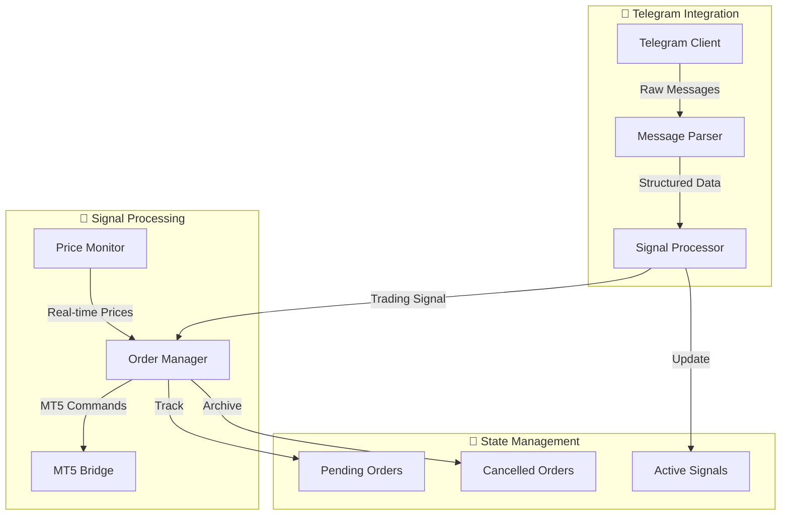
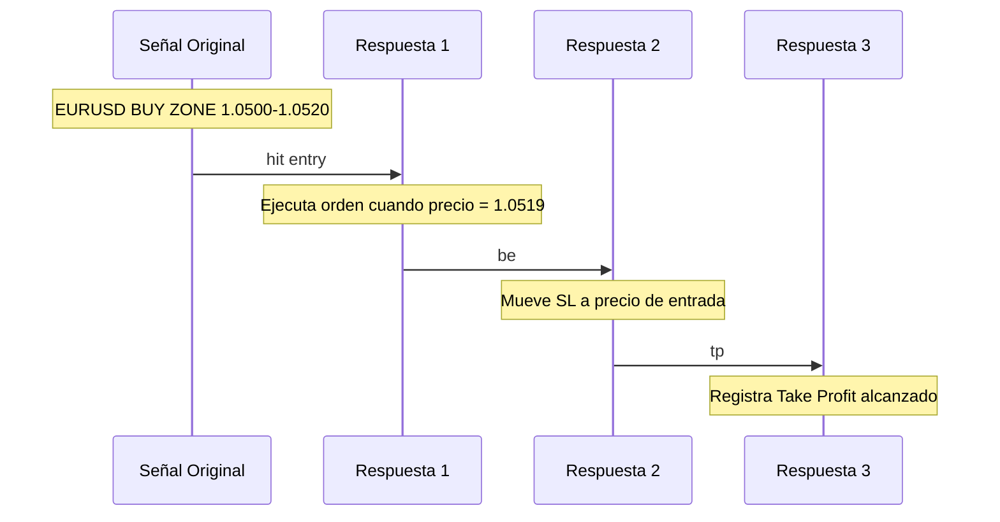
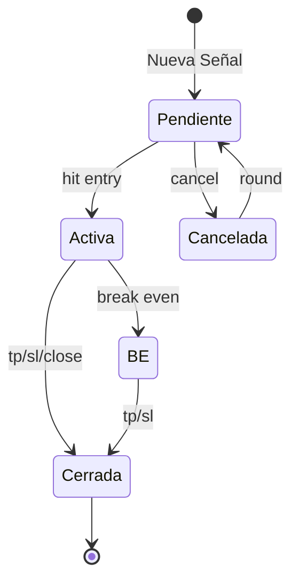
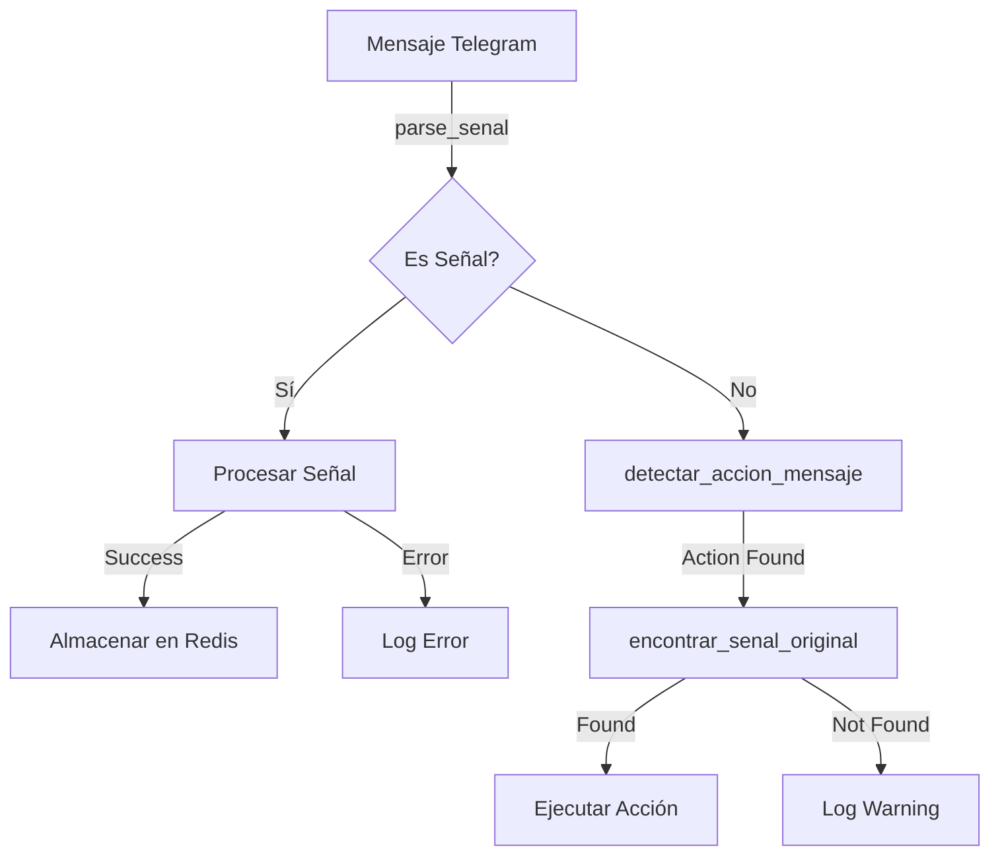

# 🤖 Trading Assistant: Bridge Telegram-MT5

[](https://opensource.org/licenses/MIT)
[](https://www.python.org/downloads/)

## 🎯 Descripción Técnica

Sistema automatizado de alta precisión que implementa un bridge entre señales de Telegram y MetaTrader 5, utilizando procesamiento asíncrono y gestión de estados para garantizar la ejecución precisa de operaciones de trading.

## 🏗 Arquitectura Core



## 🔍 Componentes Principales

### 1. 🎯 Procesador de Señales (`filters.py`)

```python
def parse_senal(texto: str) -> dict:
    """
    Extrae información estructurada de señales de trading.
    
    Implementación:
    - Regex pattern matching para símbolos: r'\b(XAUUSD|EURUSD|GBPUSD|USDJPY)\b'
    - Extracción de zonas de trading: r'\b(BUY|SELL)\b.*?ZONE\s*(\d+\.?\d*)\s*-\s*(\d+\.?\d*)'
    - Cálculo inteligente de entrada basado en tipo:
        * SELL: rango_min + 0.5
        * BUY: rango_max - 1
    
    Returns:
        {
            'simbolo': str,      # Par de trading
            'tipo': str,         # BUY/SELL
            'entrada': float,    # Precio calculado
            'sl': float,         # Stop Loss
            'tp': float         # Take Profit
        }
    """
```

### 2. 🔄 Sistema de Cascadas



### 3. 🎮 Cliente MT5 (`mt5_client.py`)

```python
def abrir_orden(symbol: str, order_type: str, lotes: float, 
                sl: float = None, tp: float = None, 
                entrada: float = None) -> int:
    """
    Ejecuta órdenes en MT5 con gestión avanzada.
    
    Características:
    - Cálculo dinámico de SL/TP basado en distancias
    - Manejo de desviaciones de precio
    - Magic number: 234000 para tracking
    - Filling policy: IOC (Immediate or Cancel)
    
    Returns:
        int: Ticket number de la orden
    """
```

## 📊 Sistema de Estados



## 🔍 Detección de Acciones

```python
def detectar_accion_mensaje(texto: str) -> str:
    """
    Sistema de detección de acciones con prioridades:
    
    1. Validación de Round:
       - Palabras inválidas: ["don't", "dont", "sl", "tp", "vip"]
       
    2. Comandos Inmediatos:
       - "buy now" -> "buy_now"
       - "sell now" -> "sell_now"
       
    3. Acciones Básicas:
       - cerrar: ["close", "closing", "closed", "exit now"]
       - be: ["break even", "move to be", "stop to entry"]
       - cancel: ["cancel", "cancelar", "cancelled"]
       - hit_entry: ["hit entry", "entry now", "execute now"]
    """
```

## 🔄 Flujo de Procesamiento



## 🛠 Configuración

```python
# MT5 Configuration
MT5_CONFIG = {
    'login': ID,
    'password': "PASSWORD",
    'server': "MetaQuotes-Demo",
    'symbols': ["XAUUSD", "EURUSD", "GBPUSD", "USDJPY",ETC]
}

# Logging Configuration
LOG_CONFIG = {
    'format': '%(asctime)s [%(levelname)s] %(name)s: %(message)s',
    'date_format': '%Y-%m-%d %H:%M:%S',
    'max_size': 10 * 1024 * 1024  # 10MB
}
```

## 📈 Ejemplos de Uso

### 1. Procesamiento de Señal Compleja
```python
# Ejemplo de señal compleja
signal = """
EURUSD
BUY ZONE 1.0500-1.0520
SL: 1.0450
TP: 1.0550-1.0600-1.0650
Lot size: 0.1
"""

# Procesamiento
parsed = parse_senal(signal)
if parsed:
    info = extract_trade_info(signal)
    parsed.update(info or {})
    
# Resultado
{
    'simbolo': 'EURUSD',
    'tipo': 'BUY',
    'entrada': 1.0519,
    'sl': 1.0450,
    'tp': 1.0600,
    'lotes': 0.1
}
```

### 2. Gestión de Cascadas
```python
# Ejemplo de seguimiento de cascada
async def process_cascade():
    msg_id, estado, texto = await encontrar_senal_original(
        mensaje_actual=current_msg,
        client=telegram_client,
        mensajes_senales=signals_dict,
        ordenes_pendientes=pending_dict,
        senales_activas=active_dict,
        senales_canceladas=cancelled_dict
    )
```

## 📊 Métricas y Logging

```python
# Ejemplo de log estructurado
{
    'timestamp': '2024-01-20 10:15:00',
    'level': 'INFO',
    'event': 'signal_processed',
    'data': {
        'symbol': 'EURUSD',
        'type': 'BUY',
        'entry': 1.0519,
        'sl': 1.0450,
        'tp': 1.0600,
        'status': 'success'
    }
}
```

## 📄 Licencia

MIT License - Copyright (c) 2024 Franx245
