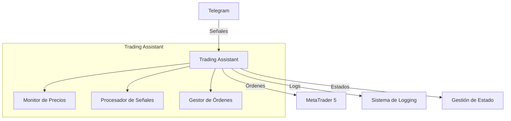
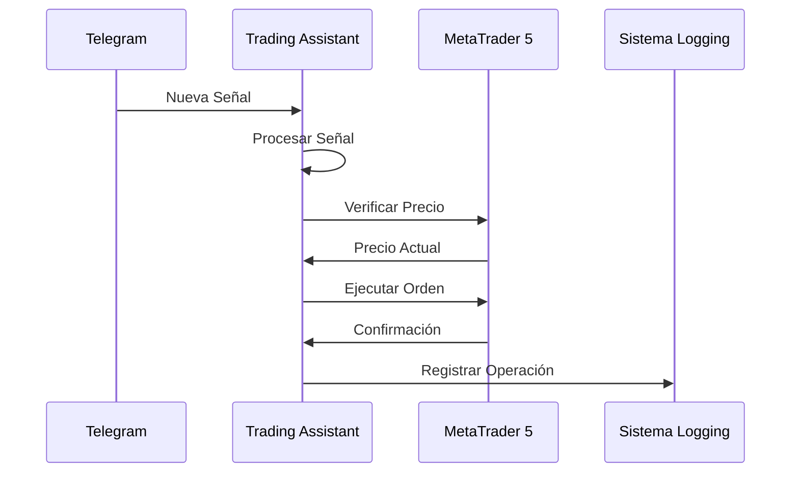
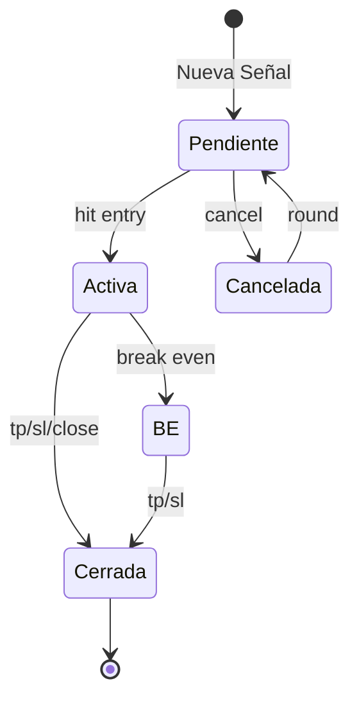

# Trading Assistant - Automatización Inteligente de Trading

## 📌 Resumen Ejecutivo

Sistema automatizado que conecta Telegram con MetaTrader 5 para ejecutar operaciones de trading de forma automática y precisa.

## 🏗 Arquitectura del Sistema



## 🔄 Flujo de Operación



## 💻 Componentes Principales

### 1. Monitor de Precios
```python
class MonitorTask:
    """
    🔍 Monitoreo 24/7 de precios
    ⚡ Ejecución automática
    📊 Seguimiento en tiempo real
    """
```

### 2. Procesador de Señales
```yaml
Formato de Señales:
  EURUSD:
    BUY ZONE: 1.0500-1.0520
    SL: 1.0450
    TP: 1.0550-1.0600-1.0650
    Lot size: 0.1
```

### 3. Sistema de Comandos
```bash
# Comandos de Entrada
hit entry   # Ejecutar orden pendiente
buy now     # Compra inmediata
sell now    # Venta inmediata

# Comandos de Gestión
be          # Break even
tp          # Take profit
close       # Cerrar posición

# Comandos de Control
cancel      # Cancelar orden
round       # Reactivar señal
list        # Listar órdenes
```

## 📊 Sistema de Logging

```
📁 Estructura de Logs
├── data/
│   └── logs/
│       ├── trading_assistant.log  # Log principal
│       ├── errors.log            # Registro de errores
│       ├── daily_YYYYMM.json     # Estadísticas diarias
│       └── actions_YYYYMM.jsonl  # Registro de acciones
```

## 🔄 Estados de Operación



## ⚡ Ventajas sobre Operación Manual

### Velocidad
| Acción | Humano | Trading Assistant |
|--------|---------|-------------------|
| Lectura de señal | 5-10s | <1ms |
| Ejecución | 10-15s | Instantánea |
| Múltiples señales | Limitado | Ilimitado |

### Precisión
- ✅ 100% precisión en precios
- ✅ Sin errores de entrada
- ✅ Gestión exacta de SL/TP
- ✅ Seguimiento perfecto

### Disponibilidad
- 🕒 Operación 24/7
- 🎯 Sin fatiga
- 📈 Sin emociones
- 🔄 Reconexión automática

## 🛡 Sistemas de Seguridad

### Verificación Triple
```python
1. Validación de señal
2. Verificación de parámetros
3. Confirmación de ejecución
```

### Protección contra Fallos
```python
try:
    # Operación principal
except Exception:
    # Recuperación automática
    try:
        # Reintento
    except:
        # Cierre seguro
finally:
    # Limpieza garantizada
```

## 📊 Panel de Control

```
╔══════════════════════════════════════╗
║     🤖 Trading Assistant v1.0.0      ║
║        Telegram + MT5 Bridge         ║
╚══════════════════════════════════════╝

📈 Estadísticas:
- Operaciones totales: 50
- Win Rate: 70%
- Uptime: 99.99%
```

## 🚀 Inicio Rápido

```bash
# 1. Configurar credenciales
export MT5_LOGIN="tu_login"
export MT5_PASSWORD="tu_password"

# 2. Iniciar sistema
python3 main.py

# 3. Seleccionar canal
> Elegí el número del canal: 1
```

## 📱 Notificaciones

```yaml
Alertas:
  Críticas:
    - ❌ Desconexión MT5
    - ⚠️ Error de ejecución
    - 🔴 Fallo de sistema
  
  Informativas:
    - ✅ Orden ejecutada
    - 💰 TP alcanzado
    - 🔒 BE activado
```

## 🔧 Mantenimiento

### Checklist Diario
- [ ] Conexión MT5
- [ ] Estado de logs
- [ ] Espacio en disco
- [ ] Rendimiento

## 📚 Recursos

- [📖 Documentación MT5](https://www.metatrader5.com/es/automated-trading/api)
- [🤖 API de Telegram](https://core.telegram.org/bots/api)
- [📊 Guía de Trading](https://www.babypips.com/learn/forex)

## 📄 Licencia

MIT License - Copyright (c) 2024 Fran
