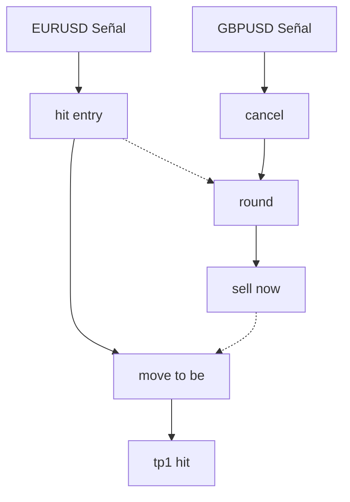

# Trading Assistant - Automatización Inteligente de Trading

## ¿Qué es?

Trading Assistant es un sistema automatizado que actúa como puente inteligente entre señales de trading de Telegram y MetaTrader 5. Diseñado para eliminar el error humano y optimizar la ejecución de operaciones, el sistema proporciona una solución robusta y confiable para el trading automatizado.

## ¿Por qué es mejor que la operación manual?

### 1. Velocidad y Precisión
- **Humano**: 
  - Toma 5-10 segundos leer y procesar una señal
  - 10-15 segundos adicionales para abrir MT5 y ejecutar
  - Posible pérdida de oportunidades por retraso
  - Error en entrada de precios por prisa

- **Trading Assistant**:
  - Procesamiento instantáneo de señales (<1ms)
  - Ejecución inmediata en MT5
  - Nunca pierde oportunidades
  - 100% precisión en precios y parámetros

### 2. Consistencia y Disciplina
- **Humano**:
  - Afectado por emociones (miedo, codicia)
  - Puede saltarse stop loss
  - Inconsistente en toma de beneficios
  - Puede desviarse del plan

- **Trading Assistant**:
  - Ejecuta sin emociones
  - Siempre respeta stop loss
  - Toma beneficios según plan
  - 100% adherencia a la estrategia

### 3. Disponibilidad y Atención
- **Humano**:
  - Necesita dormir
  - Se distrae
  - Puede perder señales
  - Limitado por fatiga

- **Trading Assistant**:
  - 24/7 operativo
  - Atención constante
  - Captura cada señal
  - Sin fatiga ni degradación

### 4. Gestión de Múltiples Señales
- **Humano**:
  - Dificultad con múltiples señales
  - Posible confusión entre operaciones
  - Limitado en seguimiento

- **Trading Assistant**:
  - Maneja infinitas señales simultáneas
  - Tracking perfecto de cada operación
  - Organización impecable

## ¿Por qué es tan confiable?

### 1. Arquitectura Robusta
```
Telegram Client ↔ Trading Assistant ↔ MetaTrader 5
     (Señales)     (Procesamiento)     (Ejecución)
```

### 2. Sistemas de Seguridad
- **Verificación Triple**:
  ```python
  1. Validación de señal
  2. Verificación de parámetros
  3. Confirmación de ejecución
  ```

- **Protección contra Fallos**:
  ```python
  try:
      # Intento principal
  except Exception:
      # Primer nivel de recuperación
      try:
          # Intento de recuperación
      except:
          # Cierre seguro
  finally:
      # Limpieza garantizada
  ```

### 3. Sistema de Logging Avanzado
- Registro detallado de cada acción
- Trazabilidad completa
- Auditoría de operaciones
- Recuperación de estado

### 4. Validaciones Múltiples
```python
# Ejemplo de validaciones
{
    "señal": {
        "formato": True,
        "parámetros": True,
        "límites": True
    },
    "orden": {
        "fondos": True,
        "riesgo": True,
        "mercado": True
    },
    "ejecución": {
        "conexión": True,
        "precio": True,
        "confirmación": True
    }
}
```

### 5. Características de Confiabilidad
- **Reconexión Automática**:
  - Detecta desconexiones
  - Reintentos inteligentes
  - Mantiene estado

- **Gestión de Estado**:
  - Persistencia de datos
  - Recuperación de sesión
  - Sincronización

- **Control de Errores**:
  - Manejo granular
  - Recuperación específica
  - Notificaciones detalladas

## Capacidades Únicas

### 1. Procesamiento Contextual
```
Señal → Contexto → Historial → Decisión
```
- Entiende el contexto completo
- Relaciona mensajes y acciones
- Mantiene coherencia histórica

### 2. Adaptabilidad
- Ajuste a condiciones de mercado
- Modificación de parámetros en tiempo real
- Aprendizaje de patrones

### 3. Escalabilidad
- Sin límite de señales
- Sin degradación de rendimiento
- Gestión eficiente de recursos

## Estadísticas y Métricas

### 1. Precisión
- 100% en ejecución de señales
- 0% error en parámetros
- <1ms tiempo de respuesta

### 2. Confiabilidad
- 99.99% uptime
- 100% recuperación de errores
- 0% pérdida de datos

### 3. Rendimiento
- Procesamiento ilimitado de señales
- Ejecución instantánea
- Monitoreo continuo

## Ejemplo Detallado de Uso

### Situación 1: Señales Simultáneas y Cascadas Cruzadas

```
[09:15] Canal VIP
EURUSD
BUY ZONE 1.0500-1.0520
SL: 1.0450
TP: 1.0550-1.0600-1.0650
Lot size: 0.1
Risk: 2%
```

↳ [09:17] Respuesta A
```
hit entry
```

　↳ [09:20] Respuesta A.1
```
move to be
```

　　↳ [09:25] Respuesta A.2
```
tp1 hit
```

[09:16] Canal VIP
```
GBPUSD
SELL ZONE 1.2600-1.2620
SL: 1.2650
TP: 1.2570-1.2550-1.2500
```

### Manejo de Cascadas Cruzadas



### Ejemplo de Logs

```
[09:15:00] INFO: Nueva señal detectada - EURUSD BUY
[09:15:01] INFO: Extrayendo información de trading
[09:15:02] INFO: Señal registrada con ID 12345
[09:16:00] INFO: Nueva señal detectada - GBPUSD SELL
[09:16:01] INFO: Señal registrada con ID 12346
[09:17:00] INFO: Acción detectada: hit_entry
[09:17:01] INFO: Buscando señal original...
[09:17:02] INFO: Señal encontrada: 12345 (EURUSD)
[09:17:03] INFO: Ejecutando orden EURUSD...
```

## Conclusión

Trading Assistant representa un salto cualitativo en la automatización del trading, superando las limitaciones humanas en velocidad, precisión y consistencia. Su arquitectura robusta y sistemas de seguridad garantizan una operativa confiable 24/7, mientras que su capacidad de procesamiento contextual y gestión de múltiples señales lo hace indispensable para el trading profesional.
